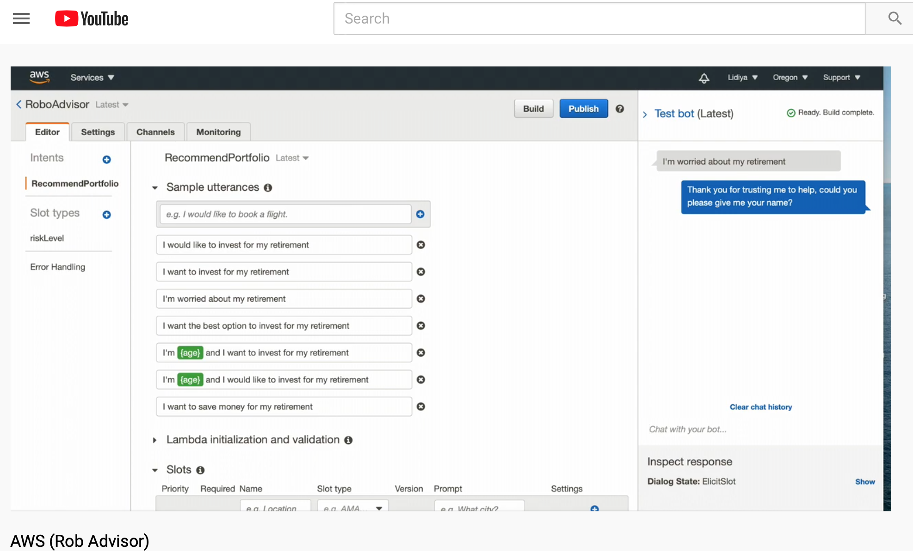

# Amazon Web Services
 http://www.youtube.com/watch?v=N_i6ewyeakI

## Robo Advisor for Retirement Plans

Hypothetically, I was hired as a digital transformation consultant by one of the most prominent retirement plan providers in the country; they want to increase their client portfolio, especially by engaging young people. Since machine learning and NLP are disrupting finance to improve customer experience, I decided to create a robo advisor that could be used by customers or potential new customers to get investment portfolio recommendations for retirement.

In this assignment, I combined Amazon Web Services skills with my already mastered Python superpowers, to create a bot that will recommend an investment portfolio for a retirement plan. 

## Packages Used

- Amazon AWS
- Amazon Lex
- VS code
- QuickTime 

## Steps Taken

- Created a Bot using AWS Lex. Created intents and sample utterances.
- Created 4 different slots to ask for name, age, amount to invest, and risk to undertake.
- Coded using AWS Lambda and used various test samples to test lambda code.
- Placed my code into my Lex bot

### Accomplishing the following main tasks:

1. **[Initial Robo Advisor Configuration:](#Initial-Robo-Advisor-Configuration)** Define an Amazon Lex bot with a single intent that establishes a conversation about the requirements to suggest an investment portfolio for retirement.

2. **[Build and Test the Robo Advisor](#Build-and-Test-the-Robo-Advisor):** Make sure that your bot is working and responding accurately along with the conversation with the user, by building and testing it.

3. **[Enhance the Robo Advisor with an Amazon Lambda Function:](#Enhance-the-Robo-Advisor-with-an-Amazon-Lambda-Function)** Create an Amazon Lambda function that validates the user's input and returns the investment portfolio recommendation. This task includes testing the Amazon Lambda function and making the integration with the bot.
